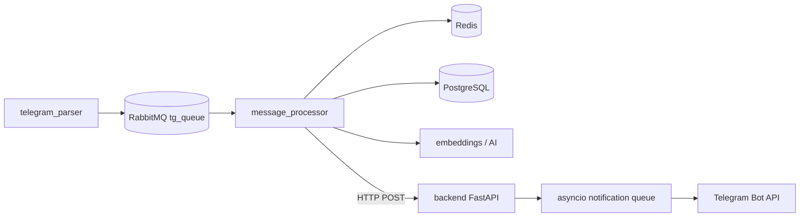
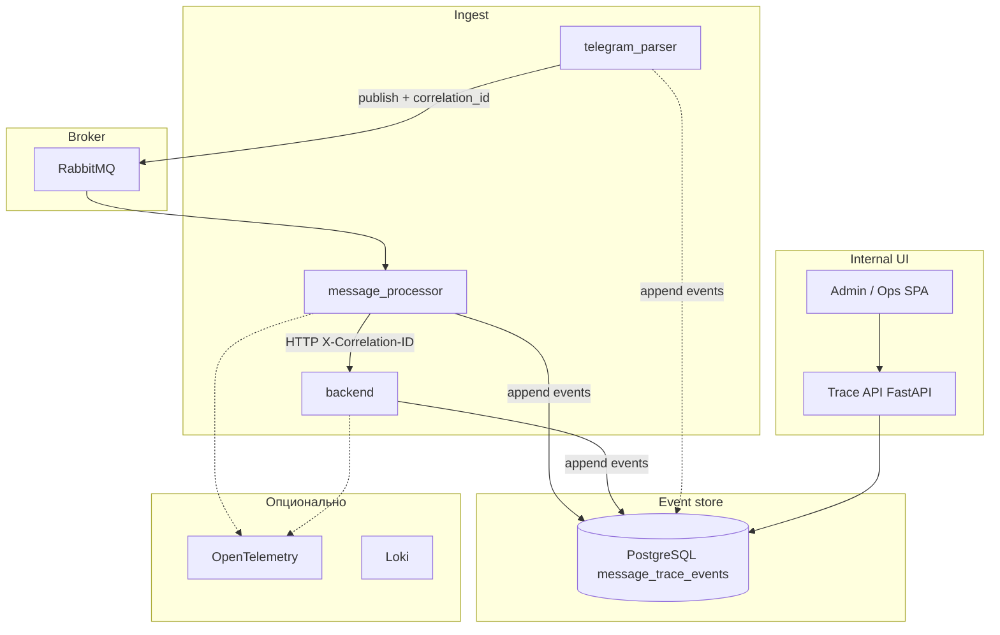

# Архитектура: прозрачность потока сообщений

Документ описывает целевую систему наблюдаемости сообщений от Telegram до уведомлений пользователю: корреляция, хранение событий, API для внутреннего UI и интеграция с существующим стеком (RabbitMQ, Redis, PostgreSQL, FastAPI, `message_processor`, `telegram_parser`, `backend`).

---

## 1. Цели и нецели

**Цели**

- По одному сообщению (или идентификатору) восстановить **полный путь**: парсер → очередь → процессор → внешние вызовы → backend → бот.
- Видеть **время между этапами**, статусы (успех, фильтр, ошибка) и **краткую причину** без чтения сырых логов.
- Иметь **внутренний UI** с поиском и временной шкалой.

**Нецели (на первом этапе)**

- Показывать полный текст сообщений из публичных чатов без контроля доступа и маскирования.
- Заменять полностью Prometheus/LangSmith; они **дополняют** систему.

---

## 2. Текущий контекст (as-is)

Упрощённая схема уже существующего пайплайна:

- Метрики: частично Prometheus (`ENABLE_METRICS`), свои счётчики в `backend` / `ai_core`.
- Логи: стандартный `logging`; сквозного `correlation_id` в сообщениях и HTTP пока нет.
- LangSmith: опционально для LLM-цепочек, не для очереди.

---

## 3. Целевая архитектура (to-be)

### 3.1 Принципы

1. **Корреляция первична**: каждое логическое «входящее сообщение» получает стабильный **`correlation_id`** (UUID v7 или ULID — удобно для сортировки по времени).
2. **События, а не только логи**: каждый значимый шаг пишется как **запись события** (для UI и запросов), логи остаются для детальной отладки.
3. **Проброс контекста**: `correlation_id` живёт в JSON тела RabbitMQ (и при необходимости в AMQP headers), в заголовках внутренних HTTP (`X-Correlation-ID`), в structured logs.
4. **Разделение каналов**: пользовательский Telegram Mini App и **internal observability UI** — разные приложения и политики доступа.

### 3.2 Логическая схема

### 3.3 Компоненты

| Компонент | Назначение |
|-----------|------------|
| **Correlation service (логика в коде)** | Генерация `correlation_id` при первом касании сообщения в `telegram_parser`; наследование при split/group в `message_processor`. |
| **Event writer (библиотека или модуль)** | Единый интерфейс: `emit_event(correlation_id, stage, status, payload_redacted, duration_ms?, parent_span_id?)`. Запись в PostgreSQL (async batch или отдельный воркер). |
| **PostgreSQL: trace storage** | Таблица(ы) событий + индексы по `correlation_id`, `(source_chat_id, source_message_id)`, `created_at`, опционально `recommendation_id`. |
| **Trace API** | Новый сервис или маршруты в существующем backend за отдельным префиксом и auth: поиск, `GET /traces/{correlation_id}`, агрегированная сводка. |
| **Internal UI** | Отдельный SPA (или модуль в монорепо): поиск, список, таймлайн, детали, JSON. |
| **OpenTelemetry (опционально)** | `opentelemetry-instrumentation-aio-pika`, FastAPI/httpx; экспорт в Tempo/Jaeger; ссылка `trace_id` в событии или в UI. |

### 3.4 Модель данных (черновик)

**Таблица `message_trace_roots`** (опционально, для быстрого списка)

- `correlation_id` (PK)
- `source_chat_id`, `source_message_id` (nullable, индекс составной)
- `first_seen_at`, `last_event_at`
- `outcome` (enum: `in_progress`, `completed`, `filtered`, `error`)
- `summary_text` (короткая строка для таблицы поиска)

**Таблица `message_trace_events`**

- `id` (bigserial или UUID)
- `correlation_id` (FK логический, индекс)
- `occurred_at` (timestamptz)
- `service` (text): `telegram_parser` | `message_processor` | `backend` | …
- `stage` (text): `publish`, `consume`, `redis_dedup`, `handler_routed`, `embedding_search`, `llm_relevance`, `save_recommendation`, `http_recommendation`, `notification_enqueued`, …
- `status` (text): `ok`, `skipped`, `filtered`, `error`
- `duration_ms` (int, nullable)
- `parent_event_id` (nullable, для вложенных шагов)
- `detail` (jsonb): безопасные поля (ids, счётчики, коды ошибок); **не** полный текст сообщения по умолчанию
- `otel_trace_id`, `otel_span_id` (nullable, hex)

Индексы: `(correlation_id, occurred_at)`, `(source_chat_id, source_message_id)`, `occurred_at DESC` для недавних.

### 3.5 Контракт сообщения RabbitMQ

В JSON payload (минимум):

- `correlation_id`: string (UUID)
- Существующие поля без изменения семантики

При публикации **частей** группового сообщения: тот же `correlation_id` или дочерний с полем `parent_correlation_id` — решение фиксируется в задачах реализации (см. backlog).

### 3.6 Trace API (черновик)

Все эндпоинты только для **internal** auth (API key, mTLS, VPN — на усмотрение деплоя).

| Метод | Путь | Описание |
|-------|------|----------|
| GET | `/internal/traces` | Поиск: query `q` (correlation id / recommendation id / `chat_id:message_id`), фильтры по времени и статусу, пагинация |
| GET | `/internal/traces/{correlation_id}` | Полная шкала: root + события, отсортированные по времени |
| GET | `/internal/traces/{correlation_id}/summary` | Короткая сводка для виджетов |

Ответ детального трейса: `{ correlation_id, summary, source?: { chat_id, message_id }, events: [...] }`.

### 3.7 Internal UI

- **Страница поиска**: одно поле + фильтры; таблица результатов.
- **Страница трейса**: вертикальный таймлайн, дельты между шагами, раскрываемый `detail`, вкладки «Сводка» / «Сырые события».
- **Маскирование**: по умолчанию скрыть или хешировать текст; раскрытие по роли.

Технологии: согласовать с командой (отдельный Vite/React проект или лёгкий шаблон рядом с `app/`).

### 3.8 Надёжность записи событий

Варианты (выбрать в реализации):

- **Синхронная запись** из горячего пути: проще, но увеличивает латентность и риск при падении БД.
- **Асинхронная очередь событий** (вторая очередь RabbitMQ или буфер) + воркер, пишущий в PostgreSQL: меньше влияние на пайплайн, сложнее эксплуатация.

Рекомендация документа: начать с **best-effort async** (fire-and-forget task с bounded queue) или отдельной лёгкой очереди, если нагрузка высокая.

### 3.9 Безопасность

- Internal UI и Trace API не публиковать в интернет без защиты.
- PII и контент чатов: политика хранения в `detail`, TTL или отсутствие текста в событиях.
- Аудит доступа к трейсам (опционально, позже).

### 3.10 Связь с существующими системами

- **Prometheus**: метрики по числу событий, ошибок записи трейса, lag очереди.
- **LangSmith**: при желании добавить в `detail` ссылку на run по `correlation_id`.
- **Grafana**: дашборды по метрикам + (опционально) datasource Loki с полем `correlation_id` в логах.

---

## 4. Этапы внедрения (высокий уровень)

1. **Корреляция и контракт** — `correlation_id` в парсере и процессоре, проброс в RabbitMQ и HTTP.
2. **Хранилище и writer** — миграции PostgreSQL, модуль записи событий.
3. **Инструментация пайплайна** — ключевые `stage` в `telegram_parser`, `message_processor`, критичные пути в `backend`.
4. **Trace API** — поиск и детальная выдача.
5. **Internal UI** — поиск и таймлайн.
6. **Укрепление** — OTel, маскирование, retention, нагрузочное тестирование writer.

Детализация — в каталоге [`/tasks`](../tasks/README.md).

---

## 5. Риски и ограничения

- Объём данных: нужна **политика retention** (например, 14–30 дней для `detail`).
- Семафор и `create_task` в `message_processor` усложняют порядок логов; события должны иметь **`occurred_at`** из кода, а не время вставки.
- Дубли correlation при ретраях: идемпотентность событий по `(correlation_id, stage, idempotency_key)` при необходимости.

---

## 6. Глоссарий

| Термин | Значение |
|--------|----------|
| **Correlation ID** | Идентификатор одной логической цепочки обработки сообщения |
| **Stage** | Именованный шаг внутри сервиса |
| **Trace (в этом документе)** | Набор событий с одним `correlation_id`, не путать только с OpenTelemetry trace |
